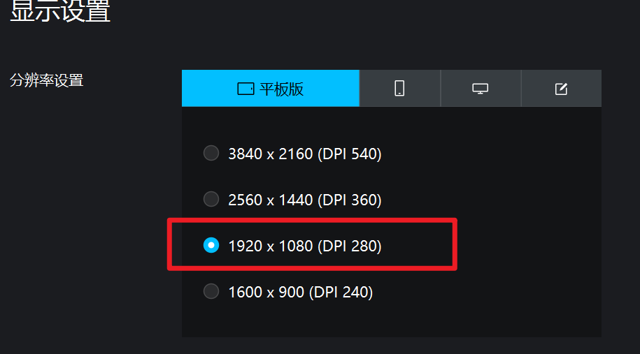

# COC-Auto: 部落冲突自动化工具

这是一个用于部落冲突(Clash of Clans)游戏自动化操作的工具集，通过ADB与图像识别技术实现在安卓模拟器或设备上自动执行游戏任务。

```

    部落冲突： 自动攻击刷资源脚本
    1. 国服夜世界：  python play_game_by_adb.py
    2. 国际服主世界： python main_world.py
```
## python环境配置

```shell

# 导出当前环境（包含版本信息）
conda env export > environment.yaml

# 创建新环境（环境名会自动从文件中读取）
conda env create -f environment.yaml
```


模拟器分辨率：
我个人使用的是MOMO模拟器， ADB连接参考： [MOMO adb doucument](https://mumu.163.com/help/20220721/35047_730476.html)


## 项目架构

```
coc-auto/
├── adb_controller.py     # ADB控制器，处理与安卓设备的交互
├── template_matcher.py   # 图像匹配工具，用于识别屏幕上的游戏元素
├── main_world.py         # 主世界相关操作
├── night_village_attack.py # 夜世界进攻自动化
├── play_game_by_adb.py   # 游戏控制脚本
├── night_world/          # 夜世界相关的模板图像
│   ├── jingong.png       # "进攻"按钮图像
│   ├── li-ji-xun-zhao.png # "立即寻找"按钮图像
│   ├── ying-xiong.png    # 英雄图像
│   ├── hui_ying.png      # 回营图像
│   ├── shou-ji.png       # "收集"按钮图像
│   ├── x.png             # 关闭按钮图像
│   └── shui_che.png      # 水车图像
└── adb_spec/             # ADB特定操作的模板图像
    └── adb_shuiche.png   # 水车ADB识别图像
```

## 主要组件介绍

### ADB控制器 (adb_controller.py)

负责与安卓设备进行通信，执行点击、滑动等操作。

主要功能:
- 截取屏幕图像
- 执行点击操作
- 执行滑动操作
- 获取设备屏幕尺寸

### 图像匹配器 (template_matcher.py)

基于OpenCV的图像模板匹配工具，用于在游戏界面中定位特定的UI元素。

主要功能:
- 在当前屏幕上查找指定模板图像
- 返回匹配位置的坐标和匹配度
- 支持调试模式，可输出匹配过程图像

### 夜世界进攻自动化 (night_village_attack.py)

自动执行夜世界中的进攻操作。

主要功能:
- 自动点击进攻按钮
- 部署英雄
- 等待战斗结束
- 收集资源

## API使用指南

### ADB控制器 API

```python
from adb_controller import AdbController

# 初始化控制器
adb = AdbController()

# 执行点击操作
adb.tap(x, y)

# 执行滑动操作
adb.swipe(start_x, start_y, end_x, end_y, duration=200)

# 获取屏幕尺寸
width, height = adb.get_screen_size()

# 获取屏幕截图
screenshot = adb.get_screenshot()
```

### 图像匹配器 API

```python
from image_matcher import ImageMatcher
from adb_controller import AdbController

# 初始化
adb = AdbController()
matcher = ImageMatcher(adb)

# 查找模板图像
result = matcher.find_template(
    "./path/to/template.png",
    threshold=0.8,  # 匹配阈值，越高要求越精确
    debug_image="debug.png"  # 可选，保存匹配结果图像
)

# 处理查找结果
if result:
    center_x, center_y, confidence = result
    print(f"找到匹配: 位置({center_x}, {center_y}), 相似度: {confidence}")
else:
    print("未找到匹配")
```

### 夜世界进攻 API

```python
from night_village_attack import attack_night_village

# 执行单次进攻
attack_night_village()

# 执行多次进攻
attack_night_village(iterations=5)
```

## 使用实例

### 自动执行夜世界进攻

```python
from night_village_attack import attack_night_village

# 执行3次夜世界进攻
success = attack_night_village(iterations=3)
if success:
    print("夜世界进攻任务成功完成")
else:
    print("夜世界进攻任务执行失败")
```

## 注意事项

1. 使用前确保ADB已正确连接到安卓设备或模拟器
2. 模板图像需要根据游戏界面和分辨率进行调整
3. 脚本执行期间请勿手动操作设备
4. 不同设备和分辨率可能需要调整相关坐标和等待时间
